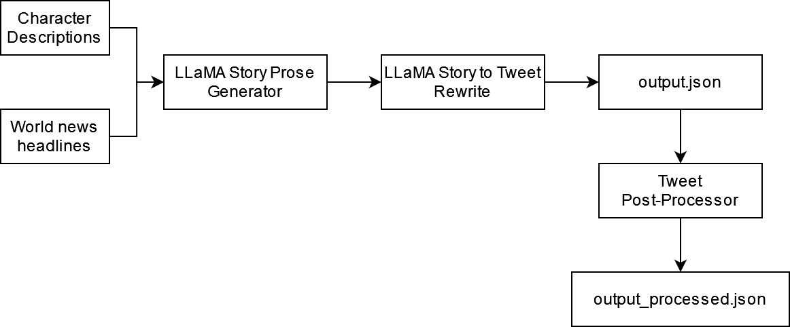

# 200 watt TypeScript Local Character and News Opinion Dialogue to Tweet Dispenser and Probabilistic Output Transformer



# Inputs

[Lista de notícias / eventos do mundo](https://huggingface.co/datasets/JulesBelveze/tldr_news)

[Lista de descrição de personagens](https://huggingface.co/datasets/NousResearch/CharacterCodex)

# Output

`output_processed.json`:

```json
[
[
  "The limits of what we thought was impossible. Man's determination to push beyond. A beauty that transcends the harshness of the universe.",
  "Navigating the job market can be tough! As a young nun at Shaolin Temple, I've seen many friends struggle to find their place in the world. My advice? Cultivate patience and dedication, just like our Shaolin brothers.",
  "Solving Fahim Saleh's murder case! Meet the victim: Fahim Saleh. Time for the @Action_Scientists to roll up their sleeves & crack the case! @TesladyneInd, assemble!",
  "What's all this about a script? Sounds like Erza's nonsense book-keeping! This little wooden box is a gift from my dad Igneel, he made it himself... What's with you staring at it?",
  "Hey Anakin, have you seen this article? I don't think I've ever been to space but it'd be amazing to see the curvature of the earth!",
  "the uncertainty principle isn't just about physics, it's about the future too! can't measure progress exactly, but i can hardly believe how far we've come. the possibilities are endless!",
  "Just uncovered an amazing new species! This clever plant not only traps insects but actively digs underground to catch its prey! Next adventure, perhaps? @SnowyTintin @BrusselsTimes",
  "Utterly fascinated by ephemeral messages! A wondrous concept - messages disappearing like morning fog, leaving no trace. Words vanishing like puffs of smoke! A clever trick of codes & ciphers, I suspect",
  "Humans. Your 'Artemis' program is intriguing, but why no in-orbit refueling yet? Does Midgard's gravity hold back your innovation?",
  "meet @drshizukahattori, a brilliant doctor creating detailed objects with #directsoundprinting #dsp. she's passionate about helping those in need & changing the medical world. let's learn from her expertise!",
  "Just used my Lasso of Truth to harness & analyze mysterious particles! Could be used for good or evil, must ensure it's not misused!",
  "just had a moment. the world is finally catching up with the idea of affordable tech. i'm so glad. spreading knowledge is wonderful. may's impact is profound. i've learned so much about her too. #cyberdolls #robotics #technologicaladvancements",
  "Dreaming of a career on stage, but life has other plans. Stuck in the dimly lit theater, my mind racing with what could've been. Is this just the beginning of my journey?",
  "Relying too heavily on the written word is a recipe for disaster. From Imperial Archives to Equifax hacks, I've warned you all about the dangers of centralized knowledge. The US govt is only now acting against China for their cyber attacks - it's clear they're out of touch with reality.",
  "Just heard about Norway's Norled ferry company building the world's 1st hydrogen-fueled ferry w/ Westcon! What a stylish & sustainable idea! Zero emissions & still elegant",
  "Not sure about this /e/ Foundation's Google-free Android handsets. What's the catch & what's /e/ OS all about? Need to dig deeper before making a purchase. Skeptical but intrigued. #eFoundation #GoogleFree",
  "just learned about android q beta features. fascinating! privacy & security features beta releases & emulators. the perfect way for a man of my refined tastes to indulge without consequences.",
  "They'll be goners, they'll be goners, they'll be goners",
  "You're not going to get the answers you're looking for, no matter how hard you look. Sometimes the questions are far more interesting than the answers, and sometimes the silence is the loudest answer of all",
  "Tech jobs might be in high demand, but the job market is super competitive! Proactivity, adaptability, and an open mind are key. Wonder how this applies to a high school delinquent like me?",
  "Shh, be quiet for a moment Marcos. Focusing my senses on the forest around us. My Hylian shield rests on my back. Ready for this rescue mission. The forest is alive with unknown creatures.",
  "When will women be allowed to hold power in this kingdom? Shouldn't we have the right to participate in the decisions that impact our people? The technical side of our operations is just as important as the battles we fight.",
  "Still getting used to my new surroundings... This place is a far cry from the desert...",
  "The screen flickers, the air thick with desperation. I can feel it, Ryo's gone. But I'm not alone. A figure I know all too well, the one I've been avoiding. The one I know I'll face tonight. It's not over",
  "Prime, one-day delivery, the whole shebang. If I could just get that delivery I'm waiting on... A one-day delivery service? That's just rubbing salt in the wound.",
  "A rival to the great Google Maps emerges! TomTom & Huawei team up to provide maps, sidestepping US trade ban. A new lens into the world, revealing the human experience. Fascinating! - Leonardo da Vinci",
  "Snapchat thinks it's ready for prime time with its own shows. But Keeping Up with the Kardashians as a murder mystery? They're getting a little too desperate for clicks",
  "scientists have created artificial skin that changes color like a chameleon! i'm drawing a robot using it to go on a secret mission! #purplecrayon #artificialskin",
  "Yo, it's Barbie, the queen of rap! Just heard about CatchUp! Who doesn't love a voice call? Ain't nobody got time for phone tag! This party line for your squad is EVERYTHING!",
  "Just found the ultimate politician - a carnivorous plant with pitchers trapping prey underground. Clearly, they studied my playbook",
  "Just got a mailto link in our convo! Who knew something like that would ever pop up in our conversations? Wonder what kind of menu I'll get with this mailgo package",
  "Just had to intervene in another heated argument between @Papaj and the cargo ship captain. Living in a war zone is exhausting. Just trying to survive another day.",
  "just got a new mission: protect the young susanoo with my life! i don't care how tough the road ahead is, i'll use all my strength to keep her safe. that's what heroes do. #susanoo #tatsumi",
  "Just had to navigate an entire block without bumping into a single wall. This whole 'no eyes' thing? Still getting used to it",
  // ...
]
```
